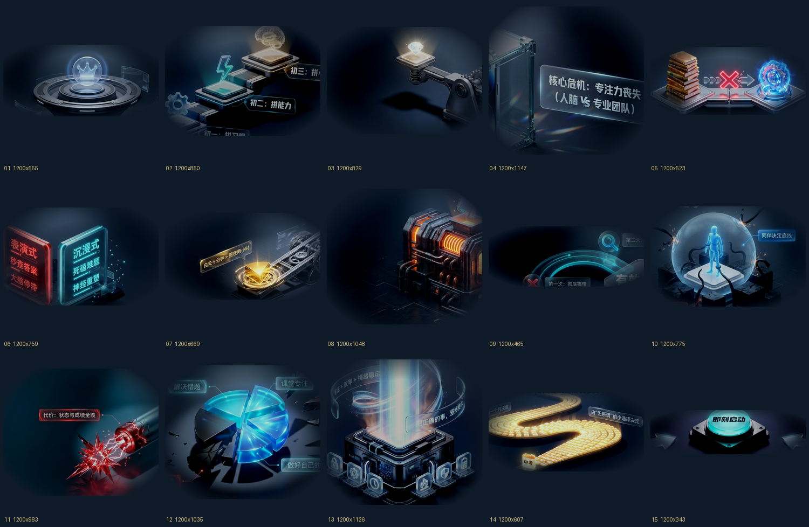

# elements/

15 个抠好的 3D 元素（`elem_01.png` … `elem_15.png`），**底色已替换成 `#0F1A28`**
—— 与 `template.html` 的视频背景完全一致，所以放进任何一帧都看不到接缝。



## 这些是什么

源素材是「一张幻灯片 = 一个 3D 概念图 + 若干中文标注」的 AI 生成图。
本目录是**用 `../extract_3d.py` 抠完并换过底色**的产物，裁框是人工读网格验片核定的
（自动定位会选中标题，原因见 `../SKILL.md`）。

**注意**：部分元素保留了源素材里的中文标注气泡（如 `elem_02` 的「初三：拼…」、
`elem_09` 的「第一次：刻意模仿」）。它们不是抠图残留，是原始设计的一部分。
如果不需要，用 `cv2.inpaint` 抹掉，或按 `../extract_3d.py` 的 `OVERRIDES` 重新收框。

## 尺寸与体积

- 统一 **1200px 宽**，高度按元素自身比例
- 合计约 **10 MB**
- 为什么要压到 1200：渲染时每帧都要解码这张图，1800px 版本实测慢 3 成以上
  （`SKILL.md` 性能一节：0.53 s/帧 vs 普通信息图动效 0.17 s/帧）

## 怎么用

```bash
mkdir -p myproj/assets && cd myproj
cp <SKILL>/assets/elements/elem_*.png assets/
```

然后在 `index.html` 的 `SHOTS` 里引用：

```js
{ st:0.0, et:4.2, form:'hero', src:'assets/elem_01.png', hs:1.34,
  title:'主标题', sub:'副标题', cap:'底部字幕条' }
```

`hs` 是元素的显示高度倍率（默认 1.0）。元素底色已统一，
**不需要再调色或加蒙版**，直接放在光池中央即可。